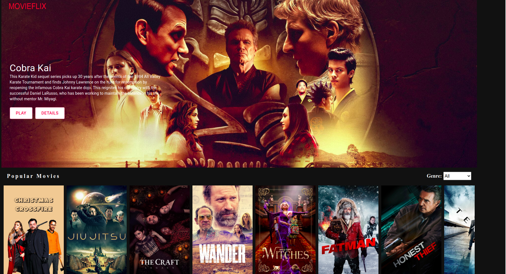
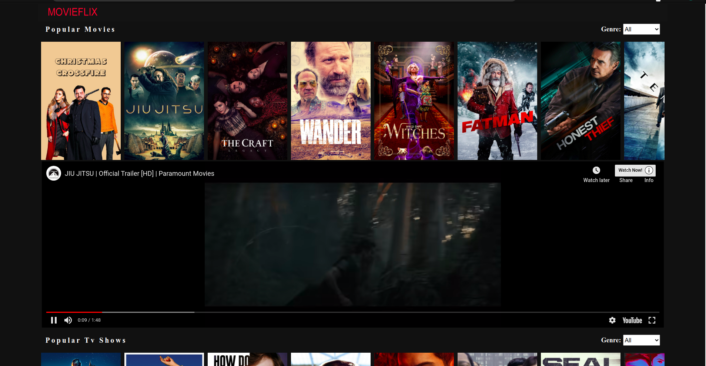
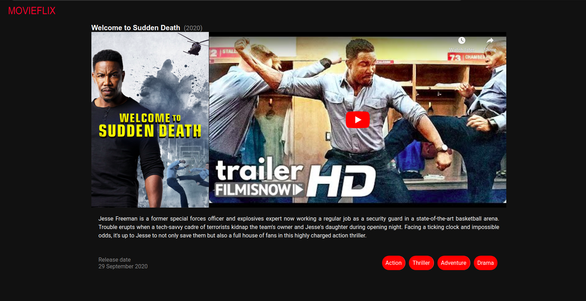

# MOVIEFLIX
This is a web application that displays Movies and TV series based on different categories. This application obtains data from TMDB via the TMDB api. The application also shows a youtube trailer of movies and tv series, which makes make it easier for users to choose which  movies to see without leaving the application. Each category can be filtered based on genres.

[Demo Link](https://5fdbdff67c8eee3c8ecd1d8e--vibrant-volhard-1d311e.netlify.app/
)

### Production Dependencies

| **Dependency**   | **Use**                                              |
| ---------------- | ---------------------------------------------------- |
| prop-types       | Declare types for props passed into React components |
| react            | React library                                        |
| react-dom        | React library for DOM rendering                      |
| react-redux      | Connects React components to Redux                   |
| react-router-dom | React library for routing                            |
| redux            | Library for unidirectional data flows                |
| redux-thunk      | Async redux library middleware                               |
| axios            | Make HTTP calls                                      |
| react-youtube    | To embed youtue player in our appliation             |
| movie-trailer    | To obtain the youtube video ID of a video            |

 
 

### Development Dependencies

| **Dependency**                  | **Use**                                                          |
| ------------------------------- | ---------------------------------------------------------------- |
| babel-eslint                    | Lint modern JavaScript via ESLint                                |
| eslint                          | Lints JavaScript                                                 |
| eslint-plugin-react-hooks       | Adds additional React-hooks-related rules to ESLint              |
| eslint-plugin-import            | Advanced linting of ES6 imports                                  |
| eslint-plugin-react             | Adds additional React-related rules to ESLint                    |
| jest                            | Automated testing framework                                      |
| enzyme                          | Test components, and write assertions                            |
| enzyme-adapter-react-16         | React adapter for enzyme                                         |
| stylelint                       | Lints Css                                                        |
| stylelint-config-standard       | Advanced linting configoration for css                           |
| stylelint-csstree-validator     | Advanced linting validation for css                              |
| stylelint-scss                  | Adds additional SCSS-related rules to StyleLint                  |

## Prerequisites
- TMDB API KEY
- Internet
- Computer

### Install and Setup

- Clone repo to your local `git@github.com:OlawaleJoseph/MovieFlix.git`
- cd into the cloned repo
- Open a terminal in the root of the app
- Run `npm install` to install dependencies
- Run Start up you server with `npm run start`
- Open http://localhost:3000/ in your browser.

### Testing
- Open a terminal and run `npm run test`.

## Author

👤 **Adedeko Olawale**

- Github: [@OlawaleJoseph](https://github.com/OlawaleJoseph)
- Twitter: [@javanode123](https://twitter.com/javanode123)
- Linkedin: [olawale-adedeko](http://www.linkedin.com/in/olawale-adedeko)

## 🤝 Contributing

Contributions, issues and feature requests are welcome!

Feel free to check the [issues page](https://github.com/OlawaleJoseph/MovieFlix/issues).

## Show your support

Give a ⭐️ if you like this project!

## Acknowledgments

- TMDB 

## 📝 License